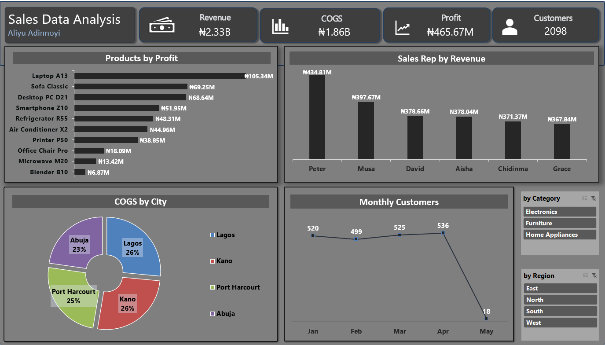

# Sales Data Analysis – Excel Data Analysis

## Business Question
What was the most profitable product?
Who made the most sales?
What city are goods sourced from mostly?
What was the worst performing month ?

## Data Source
Synthetic dataset provided by TS Academy.

## Tools Used
- Microsoft Excel (Pivot Tables, Pivot Charts, Formulas,)

## Data Cleaning & Preparation
Describe what you did in Excel to make the data usable. Even simple steps count:
- No blank cells detected.
- No duplicated detected.
- No inconsistent formatting
- Extracted month/year from date fields using `TEXT()`
- Created calculated columns: 
1.	Revenue = Unit Price * Quantity
2.	C.O.G.S = Quantity * Cost Price
3.	Profit = Revenue – C.O.G.S

## Analysis & Visualizations
- Built a pivot table aggregating KPIs.
- Built a pivot table summarizing profit by product, sales rep by revenue, city by COGS and monthly customers.
- Created dashboards and charts to appropriately visualize findings.
- Added slicers for interactivity, which cut across region and product categories.

## Key Findings
- Laptop A13 is the most profitable item, generating 105.34M in profit (over 22% of total profits).
- Sales rep Peter leads revenue generation, bringing in 434.81M – accounting for more than 19% of total revenue.
- COGS is closely distributed across cities, but Abuja claims the smallest share of total COGS. This likely reflects that a lower volume of goods was sold in Abuja compared to other cities.
- May recorded the lowest number of customers – only 18 customers, compared to ana average of 520 in the preceding months.

## Dashboard Snapshot
  

