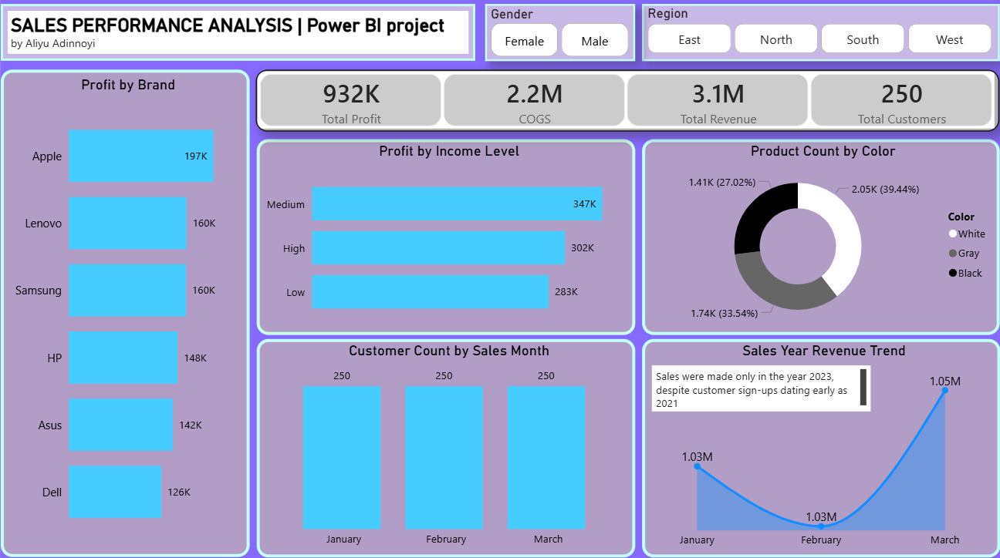

# Sales Performance Analysis – TS Academy Dataset
An interactive Power BI report with slicers for gender and region. Users can filter all visuals to explore specific segments, and the key findings above summarize the dominant patterns observed across the full dataset.

## Dataset Overview
Synthetic sales dataset provided by TS Academy (customers, products, sales tables) covering transactions in 2023.

## Business Question
What drives profit in this sales dataset? Which products, customer segments, and months deliver the most value?

## Tools Used
Excel (for initial exploration), Power BI (Power Query for data transformation, DAX for measures)

## Data Cleaning
**Customers table**
- Unified gender casing (e.g., "Male" / "Female")
- Extracted Year and Month from SignupDate

**Products table**
- Standardized brand names for consistency
- Removed blank rows

**Sales table**
- Extracted Year and Month from SaleDate

## Data Modelling
- Connected Products and Sales on ProductId
- Connected Customers and Sales on CustomerId

## Key Findings
1.	Apple products led profits with 197K (over 21%), suggesting premium pricing power.
2.	Middle-income earners contributed the most to profits, generating over 37% of total profits, equivalent to 347K.
3.	White was the top-selling product color – over 39% of units sold were white indicating a strong customer preference.
4.	The customer base remained evenly distributed across all months in 2023. No single month underperformed in attracting customers
5.	March captured the most revenue – despite the even customer base, March overtook both January and February in total revenue, likely due to higher-priced items or larger quantity sizes.

## Dashboard

## Recommendation
Prioritize Apple product marketing to middle-income customers in Q1 to maximize both customer acquisition and revenue.

